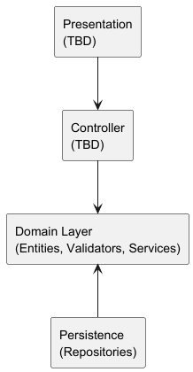

# Notes App

A framework-agnostic notes application demonstrating Domain-Driven Design (DDD) principles and clean layered architecture in Java. This project serves as a learning resource for DDD and clean architecture, focusing on extensibility and maintainability.

## Architecture
The application is structured into four main layers:

1. **Domain Layer**: Core business logic and domain entities.
   - **Entities** (e.g., `Note`): Represent business objects with properties like `id`, `title`, and `content`.
   - **Validators** (e.g., `NoteValidator`): Ensure entities adhere to business rules (e.g., title must not be empty).
   - **Services** (e.g., `NoteService`): Orchestrate domain, persistence, and presentation layers.
2. **Persistence Layer**: Implements data storage and retrieval (e.g., `NoteRepository`).
3. **Controller Layer**: Handles incoming requests and coordinates between the presentation and domain layers. (TBD)
4. **Presentation Layer**: User interface components. *(TBD)*

### Diagram



- **Dependency Direction:** (solid line) all layers depend inward toward the Domain layer, which contains the core business logic.
- **Flow of Control:** is top-down.

## Prerequisites
- Java 21 or higher
- Maven 3.6+

## Build and Run
```sh
cd notes-app
mvn clean test
```

## License
This project is licensed under the terms of the [LICENSE.txt](LICENSE.txt) file.
